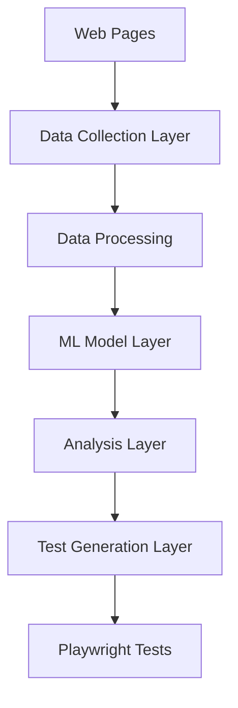

# Architecture Overview

## System Architecture

The Playwright AI Test Generator is built on a modular architecture consisting of several key components:

### 1. Data Collection Layer
- **Web Scraper**: Collects HTML elements and their properties from diverse websites
- **Data Normalizer**: Standardizes collected data for training
- **Feature Extractor**: Extracts relevant features from HTML elements

### 2. ML Model Layer
- **BERT-based Encoder**: Processes textual features of HTML elements
- **Numerical Feature Processor**: Handles boolean and numerical properties
- **Multi-task Classifier**: 
  - Element Type Classification
  - Semantic Role Classification

### 3. Analysis Layer
- **Element Analyzer**: Processes and categorizes web elements
- **Confidence Scorer**: Evaluates prediction reliability
- **Pattern Recognizer**: Identifies common web patterns

### 4. Test Generation Layer
- **Test Strategy Generator**: Determines appropriate test approaches
- **Playwright Code Generator**: Creates test scripts
- **Validation Engine**: Verifies generated tests

## Component Interactions

## Key Technologies

1. **Frontend**
   - Playwright for web automation
   - TypeScript for test scripts

2. **Backend**
   - Python 3.9+
   - PyTorch for ML model
   - transformers library
   - scikit-learn

3. **Data Processing**
   - Beautiful Soup 4
   - Pandas
   - NumPy

## Performance Considerations

1. **Model Optimization**
   - GPU acceleration
   - Mixed precision training
   - Batch processing

2. **Memory Management**
   - Efficient data loading
   - Resource cleanup
   - Caching strategies

3. **Scalability**
   - Parallel processing
   - Distributed training
   - Load balancing

## Security Measures

1. **Data Protection**
   - Secure data collection
   - PII filtering
   - Data encryption

2. **Access Control**
   - API authentication
   - Rate limiting
   - Request validation

## Future Extensibility

The architecture is designed to be extensible in several ways:
1. New model architectures can be plugged in
2. Additional test generation strategies can be added
3. Support for new web technologies can be integrated
4. Custom test frameworks can be supported
